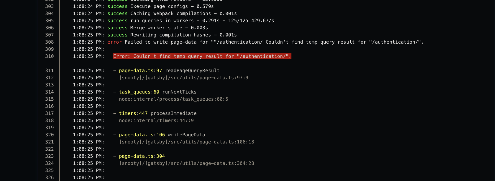
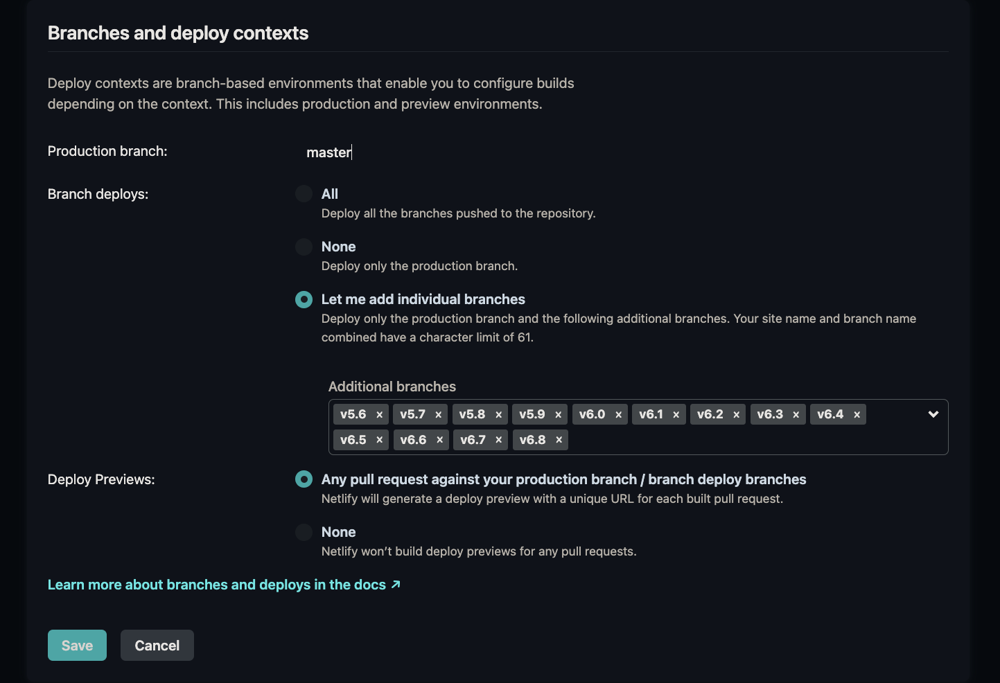

Running Netlify Extensions Locally
Testing an extension locally is a great way to ensure your changes work as intended without needing to deploy directly to production. By default, Netlify Extensions will be deployed automatically to production when merged to main. This makes testing locally important.

First, you’ll want to use a content repository to test the extension, if the extension you’re working with uses build handlers. Right now, all of our extensions, except for the Slack deploy extension, use build handlers.

If you haven’t already, make sure you have the Netlify CLI installed:

`npm install netlify-cli -g`

Once installed, clone the content repository. You'll want to the the `build.sh`. By default, the `build.sh` cURLs the `build-site.sh` script and executes that shell file.

This is to allow us to centrally locate the script, and make modifications in a single place. In our case, we have to make a small modification because most of us are using a Mac, and the script downloads a Linux version of the parser.
Netlify doesn't support using Docker, unfortunately, but it could be a good option for us as a way to develop locally.

To resolve this, copy this code, and place it in the `build.sh` file in the content repository that you are working with.

```sh
PARSER_VERSION=0.18.3

# This make command curls the examples for certain repos.

# If the rule doesn't exist, the error doesn't interrupt the build process.

make examples

if [ ! -d "snooty-parser" ]; then
echo "snooty parser not installed, downloading..."
curl -L -o snooty-parser.zip https://github.com/mongodb/snooty-parser/releases/download/v${PARSER_VERSION}/snooty-v${PARSER_VERSION}-darwin_x86_64.zip
unzip -d ./snooty-parser snooty-parser.zip
chmod +x ./snooty-parser/snooty
fi

echo "======================================================================================================================================================================="
echo "========================================================================== Running parser... =========================================================================="
./snooty-parser/snooty/snooty build . --output=./bundle.zip
echo "========================================================================== Parser complete ============================================================================"
echo "======================================================================================================================================================================="

if [ ! -d "snooty" ]; then
echo "snooty frontend not installed, downloading"
git clone -b netlify-poc --depth 1 https://github.com/mongodb/snooty.git
echo GATSBY_MANIFEST_PATH=$(pwd)/bundle.zip >> ./snooty/.env.production
cd snooty
npm ci --legacy-peer-deps
git clone --depth 1 https://github.com/mongodb/docs-tools.git ./snooty/docs-tools
mkdir -p ./snooty/static/images
mv ./snooty/docs-tools/themes/mongodb/static ./static/docs-tools
mv ./snooty/docs-tools/themes/guides/static/images/bg-accent.svg ./static/docs-tools/images/bg-accent.svg
fi

if [ -d "docs-worker-pool" ]; then
node --unhandled-rejections=strict docs-worker-pool/modules/persistence/dist/index.js --path bundle.zip --githubUser netlify
fi

cd snooty && npm run build:no-prefix
```

After modifying this script, you can run the following command to run a Netlify build locally:

`netlify build --context=dev`

To add your extension to your local build, you'll need to update your `netlify.toml` to reference your extension:

```toml
# Use your extension’s slug as the name. This can be found in the integration/extension.yml file which
# lives in the root directory of your extension.
[[integrations]]
   name = "my-extension"

[integrations.dev]
  # Set the "path" as the path from your test site to your extension’s build folder.
  path = "../path/to/extension/repository"
  # The following forces the extension to be used when building the test site.
  force_run_in_build = true
```

Now when running `netlify build --context=dev`, the extension will be installed and run during the local build process.

For more information, the docs on local extension development can be found [here](https://developers.netlify.com/sdk/build-event-handlers/debug-and-test/).

## Debugging Common Issues

### Site has incorrect or no netlify.toml file

The way this manifests is the Netlify build failing with the following error in the deploy stage:

```
2:06:05 PM: Starting to deploy site from '/'
2:06:11 PM: Failed during stage 'building site': Invalid filename 'snooty/node_modules/es5-ext/array/#/first-index.js'. Deployed filenames cannot contain # or ? characters
2:06:11 PM: Section completed: deploying
2:06:11 PM: Failing build: Failed to build site
```

This stems from Netlify uploading all files within the directory, but not uploading the snooty/public output. In the case of not having a netlify.toml, make sure their branch is up-to-date with their master branch.

Although less likely, writers may have an incorrectly configured netlify.toml. Namely, there were some instances where the netlify.toml was out-of-date. Instead of containing the `[build]` section to specify the publish directory and build command, I instead used the `[context.production]` section. This meant that the build script was never run in deploy previews or branch deploys.

[An example of updating an out-of-date netlify.toml](https://github.com/10gen/docs-mongodb-internal/pull/9148/commits/e6c2ed359e3ef9cd36b280019986569f709b70ec)

### `Error: Couldn't find temp query result for "X”`

This error stems from the Netlify workers running out of memory. This is usually remedied by clearing the cache of the Netlify site.



[Example of this issue occurring](https://mongodb.slack.com/archives/C018UTGP23T/p1727460846124379)

### Builds not starting even when writers create a PR

This occurs when the branch they are creating a PR against is not added as a deployable branch in Netlify. To resolve this, go to the content repository's corresponding Netlify site, view the site configuration, go to `Build and Deploy`, and add the branch that they want to merge their PR into as a branch deploy in the `Branches and Deploy Contexts` section:



### `bash: ./build.sh: No such file or directory`

This error occurs when a branch that a writer is working on does not have the `build.sh` file. This is due to a writer working with a branch that has not been updated.

Oftentimes, if the `build.sh` is not present, neither is the `netlify.toml`. To remedy this, simply add each respective file to the working branch that is failing.

```sh
# build.sh
# ensures that we always use the latest version of the script
if [ -f build-site.sh ]; then
  rm build-site.sh
fi

curl https://raw.githubusercontent.com/mongodb/docs-worker-pool/netlify-poc/scripts/build-site.sh -o build-site.sh
sh build-site.sh
```

```toml
# netlify.toml
[[integrations]]
  name = "snooty-cache-plugin"

[build]
  publish = "snooty/public"
  command = ". ./build.sh"
```
